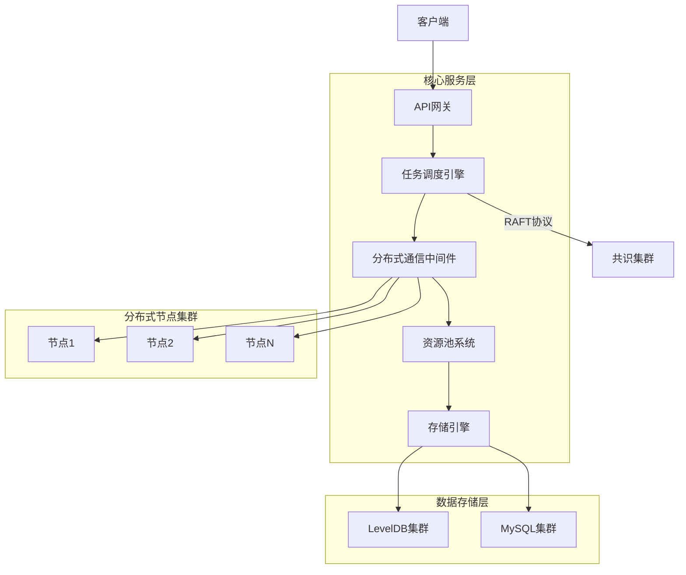
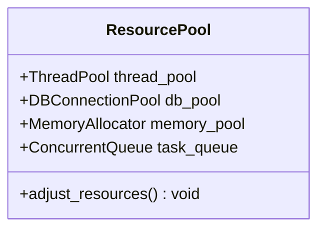

# 基于分布式架构的RIS通感一体化仿真平台


**国家自然科学基金项目** - 为山地城市复杂环境中的可重构智能表面(RIS)技术提供高性能仿真平台

## 项目概述

本项目是一个基于分布式架构的RIS（可重构智能表面）通感一体化仿真平台，旨在模拟和优化RIS技术在山地城市复杂环境中的通信和感知协同性能。平台支持200+节点的大规模分布式仿真，实现了毫秒级任务调度和亿级地形数据的快速检索。

**核心创新点**：
- 分布式通信中间件实现12W+ QPS吞吐量
- 基于Raft协议的任务调度引擎（故障恢复<500ms）
- 亿级地形数据毫秒级查询优化
- 全链路性能调优使端到端延迟降至15ms内

## 技术架构



## 核心功能

### 1. 分布式通信中间件
- 基于ZeroMQ（ROUTER-DEALER模式）和Protobuf构建
- 支持200+节点的高并发通信
- 实现12W+ QPS的消息吞吐量
- 断网自动恢复机制适应山地环境

```cpp
// 通信框架核心代码示例
zmq::context_t context(1);
zmq::socket_t router(context, ZMQ_ROUTER);
router.bind("tcp://*:5555");

while (true) {
    zmq::message_t identity;
    router.recv(identity);
    // ... 消息处理逻辑
}
```

### 2. 资源池系统
- **动态线程池**：支持自动扩缩容策略
- **数据库连接池**：统一管理MySQL和LevelDB访问
- **内存池**：集成tcmalloc降低内存碎片
- **无锁队列**：使用moodycamel::ConcurrentQueue减少线程切换



### 3. Raft分布式任务调度引擎
- 实现Raft共识算法（Leader选举、日志复制）
- 节点故障自动恢复（<500ms切换）
- 任务优先级调度机制
- 状态机同步保障数据一致性

### 4. LevelDB存储优化
- 网格空间分区索引（`GRID_X_Y_Z`键结构）
- 集成布隆过滤器减少70%磁盘IO
- 热点数据缓存策略
- 批量写入优化（WriteBatch）

### 5. 全链路性能调优
- 无锁队列减少线程竞争
- tcmalloc降低内存碎片（碎片率22%→8%）
- 两级缓冲队列（实时+批处理）
- 零拷贝数据传输


## 技术栈

- **编程语言**: C++20
- **通信框架**: ZeroMQ 4.3.4, Protocol Buffers 3.21
- **存储引擎**: LevelDB 1.23, MySQL 8.0
- **分布式算法**: Raft共识算法
- **性能工具**: tcmalloc, moodycamel::ConcurrentQueue
- **操作系统**: Linux (Ubuntu 20.04 LTS)
- **构建工具**: CMake 3.22, GCC 11.3


---

**国家自然科学基金项目**
