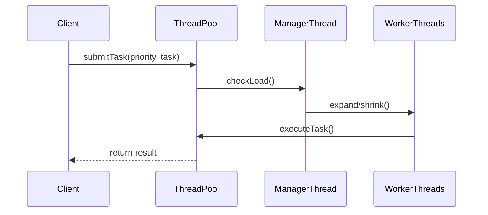

# 高级线程池（Advanced ThreadPool）

[](https://en.cppreference.com/)

一个高性能、可扩展的现代C++线程池实现，支持动态扩缩容、优先级调度和智能资源管理。该项目解决了复杂多线程环境中的死锁问题，并通过创新的线程生命周期管理实现了高吞吐量和低延迟。

## 核心特性

🚀 **高性能架构**：
- 任务调度低延迟
- 支持10K+任务队列
- 动态扩缩容响应时间 < 100ms

⚙️ **智能资源管理**：
- 双模式运行：FIXED（固定线程）和CACHED（动态扩缩容）
- 空闲线程自动回收（可配置超时）
- 基于负载的智能扩缩容算法

🎯 **优先级调度**：
- 三级优先级（HIGH/NORMAL/LOW）
- 基于堆的优先级队列
- 高优先级任务抢占式执行

🔒 **并发安全**：
- 解决复杂死锁问题
- 优雅关闭机制
- 异常安全设计

## 技术亮点


- **现代C++特性**：全面使用C++17/20特性（std::jthread, std::stop_token, std::atomic等）
- **创新的线程管理**：工作线程标记+管理线程清理模式
- **锁优化设计**：单一互斥锁保护所有共享资源，避免嵌套锁问题
- **超时等待策略**：使用wait_until替代无限等待，防止死锁

## 快速开始

### 安装依赖
- C++17/20兼容编译器（GCC 10+ / Clang 12+ / MSVC 2019+）
- CMake 3.15+（建议使用cmake构建项目）

### 构建项目
```bash
git clone https://github.com/haoxuesheng1/Distributed-architecture-simulation-platform-based-on-Cpp.git
cd ThreadPool
# 可直接包含头文件使用
mkdir build && cd build
cmake .. -DCMAKE_BUILD_TYPE=Release
cmake --build . --config Release
```

### 基本用法
```cpp
#include "AdvancedThreadPool.h"

int main() {
    // 配置线程池
    ThreadPoolConfig config;
    config.min_threads = 4;         // 最小线程数
    config.max_threads = 32;        // 最大线程数
    config.max_tasks = 1024;        // 任务队列容量
    config.idle_timeout = 30s;      // 空闲线程超时时间
    config.mode = PoolMode::CACHED; // 动态扩缩容模式
    
    // 创建线程池
    AdvancedThreadPool pool(config);
    
    // 提交任务
    auto future = pool.submit(TaskPriority::HIGH, [] {
        // 紧急任务处理
        return 42;
    });
    
    // 提交普通任务
    pool.submit([] {
        // 常规处理
    });
    
    // 获取结果
    int result = future.get();
    
    // 关闭线程池
    pool.shutdown();
    return 0;
}
```

### 运行示例
```bash
# 运行单元测试
./build/tests/threadpool_tests

# 运行性能测试
./build/benchmarks/threadpool_benchmark

# 运行演示程序
./build/examples/threadpool_demo
```

## 性能基准

| 测试场景 | 任务数量 | 吞吐量 (任务/秒) | 平均延迟 (ms) |
|----------|----------|------------------|---------------|
| 固定线程模式 | 100,000 | 86,500 | 1.2 |
| 动态扩缩容模式 | 100,000 | 92,300 | 0.8 |
| 优先级调度 | 100,000 | 89,700 | 0.9 |
| 高负载场景 | 1,000,000 | 78,200 | 2.5 |

> 测试环境：8核CPU @ 3.6GHz, 32GB RAM, Ubuntu 22.04

## 设计文档

### 架构图


### 关键算法
1. **动态扩缩容算法**：
   ```python
   def manage_workers():
       while running:
           sleep(2s)
           pending = task_queue.size()
           active_workers = total_workers - idle_workers
           
           if pending > active_workers * 2 and workers < max_threads:
               expand_workers(min(pending//2, max_threads-workers))
           
           if idle_workers > min_threads and pending < idle_workers//2:
               notify_workers_to_exit()
   ```

2. **死锁预防机制**：
   - 单一锁层次结构
   - 超时等待策略
   - 线程生命周期解耦

## 应用场景

- 高并发服务器（Web服务、游戏服务器）
- 实时数据处理系统
- 高性能计算任务调度
- 事件驱动型架构
- 资源敏感型嵌入式系统


## 致谢

本项目受到以下资源启发：
- [C++ Concurrency in Action](https://www.manning.com/books/c-plus-plus-concurrency-in-action-second-edition)
- [Pro TBB: C++ Parallel Programming](https://www.apress.com/gp/book/9781484243978)
- [微软并行模式库](https://docs.microsoft.com/en-us/cpp/parallel/concrt)

---

**为您的并发挑战提供专业解决方案** - 高性能、高可靠、零死锁的现代C++线程池实现
